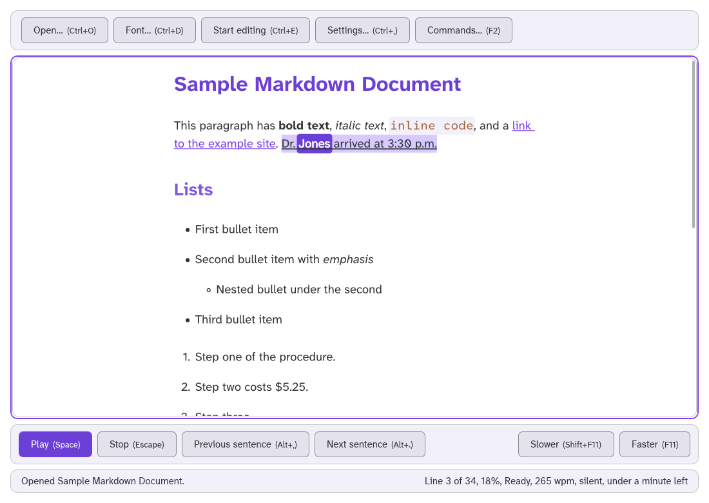
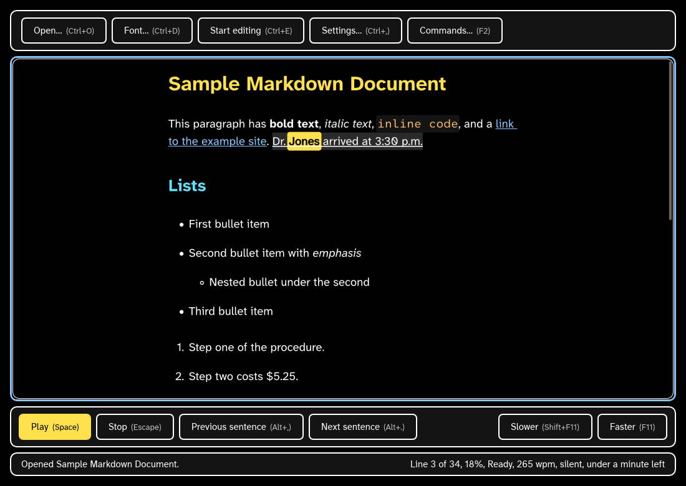
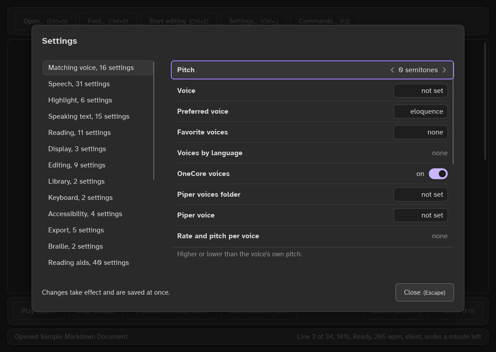
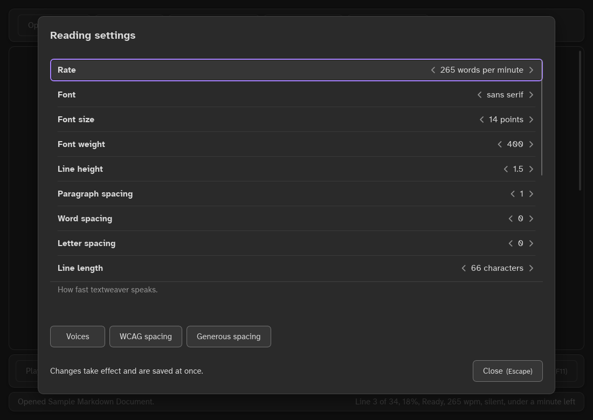
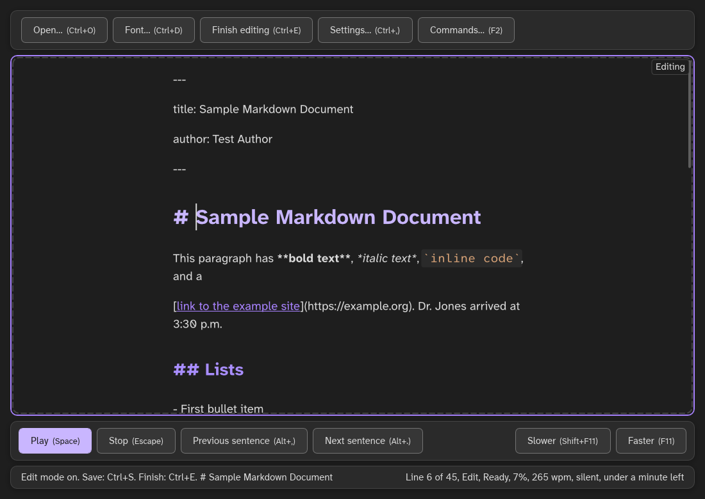

# The window in pictures

These eight pictures show the textweaver window (`textweaver-gui`) to a new user. They are drawn without a window on screen, by Vello's CPU renderer, from the same widgets the window uses, with the sample document `fixtures/sample.md` and fresh settings. Unless a description says otherwise, the window is 1100 by 780 pixels at 100 percent scale.

The reading position is on the word "Jones" in the first paragraph: the spoken word has a solid band, and its sentence ("Dr. Jones arrived at 3:30 p.m.") a paler band and an underline, so the sentence never depends on its band color alone. For the pictures, `[highlight] granularity` is "both"; the default, "word", draws the word only.

To draw the full review set (every theme at 100 and 200 percent, every dialog, the reading aids and the small window sizes), run the review harness with a folder outside `docs/`, for example under the build's target folder:

```text
textweaver-gui --review-screenshots target/review-screenshots fixtures/sample.md
```

## Reading, in Galaxy


Description: dark gray window, the default Galaxy theme. The header has the buttons Open, Font, Start editing, Settings and Commands, each with its key. The document fills the middle in a centered column, framed in purple because it has the focus: the purple title "Sample Markdown Document", a paragraph with bold, italic, code and a link, the heading "Lists", bullets with a nested one, and a numbered list. The reading toolbar below has Play (filled purple, the main action), Stop, Previous sentence, Next sentence, Slower and Faster. The word "Jones" has a solid lilac band, and its sentence a paler band with a line under it. The status bar says "Opened Sample Markdown Document." on the left and "Line 3 of 34, 18%, Ready, 265 wpm, silent, under a minute left" on the right.

## Reading, in Galaxy Light



Description: the same reading view in Galaxy Light: near-white panels, dark text, a purple frame on the document, and Play in solid purple with white text.

## Reading, in High Contrast



Description: black background with white text and white button borders. Headings are yellow and cyan, the spoken word "Jones" is black on yellow, and Play is solid yellow.

## Reading, in Lamplight


Description: the reading view in Lamplight, the soft dark theme: dark brown panels, cream text, amber headings and an amber Play button, light blue links, and a pale blue frame on the document.

## A narrow window


Description: the window at 780 by 540 pixels, just under the folding width. Below 800 pixels wide, the header and the toolbar fold into one bar above the document, and the buttons hide their keys. The bar holds two rows of buttons: Open, Font, Start editing, Settings and Commands, then Play, Stop, Previous sentence and Next sentence, with Slower and Faster at the right. The document shows the title, the first paragraph and the start of the list, and the status bar fits on one line.

## Settings, with a filter



Description: the Settings dialog over the dimmed window, with "voice" typed as a filter. The first section in the list on the left is now "Matching voice, 16 settings", selected, and the other sections follow. On the right are the matching settings: Pitch (selected, "0 semitones"), Voice, Preferred voice, Favorite voices, Voices by language, OneCore voices ("on" with its switch), Piper voices folder, Piper voice, and Rate and pitch per voice. The section's name says what was typed.

## The Reading settings dialog



Description: a dialog titled "Reading settings" with one list: Rate (selected, "265 words per minute"), Font ("sans serif"), Font size ("14 points"), Font weight ("400"), Line height ("1.5"), Paragraph spacing ("1"), Word spacing ("0"), Letter spacing ("0") and Line length ("66 characters"), each between two arrows. Under the list is the selected setting's description, "How fast textweaver speaks." Then come the buttons Voices, WCAG spacing and Generous spacing, the line "Changes take effect and are saved at once.", and "Close (Escape)".

## Edit mode



Description: after Start editing, the document's frame turns dashed and an "Editing" badge sits in its top right corner. The document shows its Markdown source: the front matter between two lines of dashes, then "# Sample Markdown Document" with the caret after the number sign. Markup stays visible and styled (bold, italic, code and the link), and list lines start with their own dashes. The header's button now says "Finish editing (Ctrl+E)", and the status bar says "Edit mode on. Save: Ctrl+S. Finish: Ctrl+E." and "Line 6 of 45, Edit, Ready, 7%".

## See also

- [The textweaver window](gui.md)
- [Reading aids](reading-aids.md)
- [Themes](themes.md)
